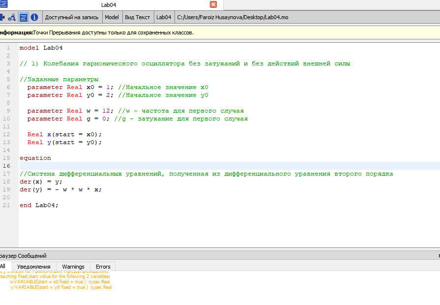
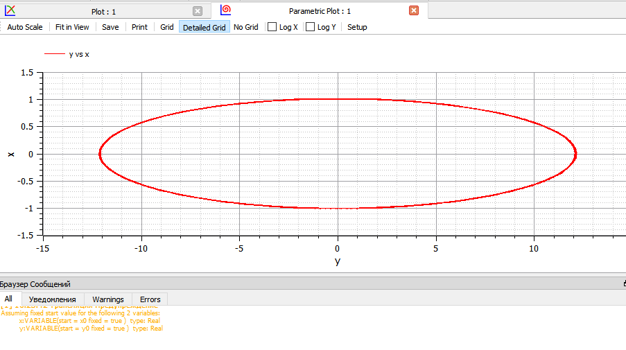
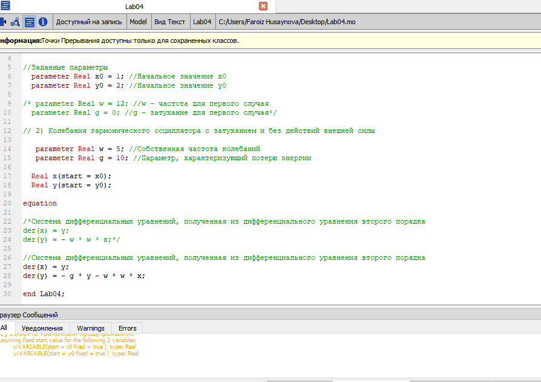
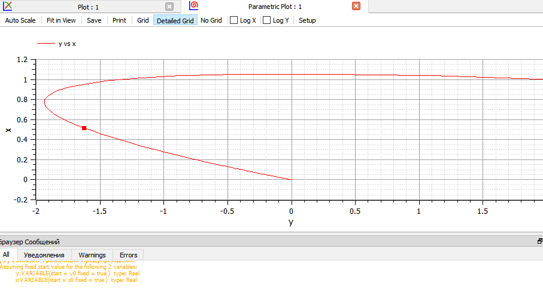
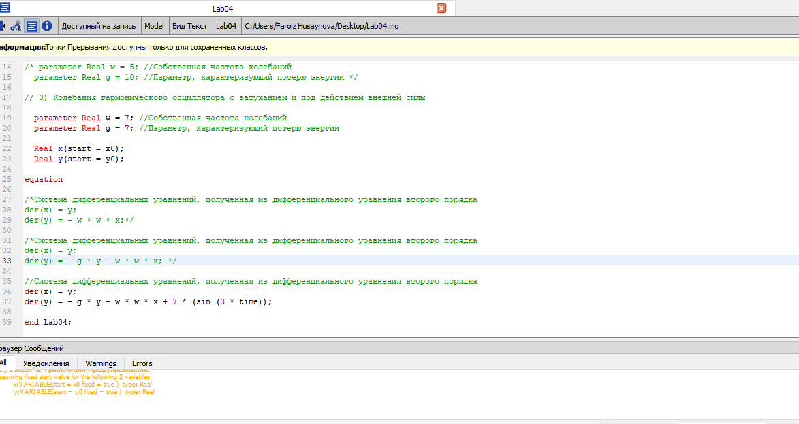
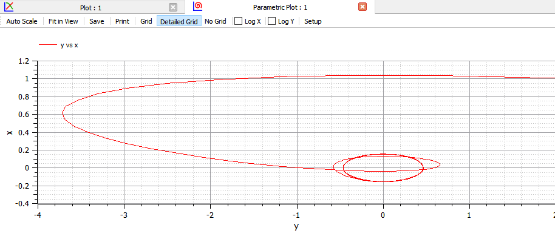

---
# Front matter
lang: ru-RU
title: "Лабораторная работа №4 по математическому моделированию"
subtitle: "Модель гармонических колебаний"
author: "Хусайнова Фароиз Дилшодовна"

# Formatting
toc-title: "Содержание"
toc: true # Table of contents
toc_depth: 2
lof: true # List of figures
lot: true # List of tables
fontsize: 12pt
linestretch: 1.5
papersize: a4paper
documentclass: scrreprt
polyglossia-lang: russian
polyglossia-otherlangs: english
mainfont: PT Serif
romanfont: PT Serif
sansfont: PT Sans
monofont: PT Mono
mainfontoptions: Ligatures=TeX
romanfontoptions: Ligatures=TeX
sansfontoptions: Ligatures=TeX,Scale=MatchLowercase
monofontoptions: Scale=MatchLowercase
indent: true
pdf-engine: lualatex
header-includes:
  - \linepenalty=10 # the penalty added to the badness of each line within a paragraph (no associated penalty node) Increasing the value makes tex try to have fewer lines in the paragraph.
  - \interlinepenalty=0 # value of the penalty (node) added after each line of a paragraph.
  - \hyphenpenalty=50 # the penalty for line breaking at an automatically inserted hyphen
  - \exhyphenpenalty=50 # the penalty for line breaking at an explicit hyphen
  - \binoppenalty=700 # the penalty for breaking a line at a binary operator
  - \relpenalty=500 # the penalty for breaking a line at a relation
  - \clubpenalty=150 # extra penalty for breaking after first line of a paragraph
  - \widowpenalty=150 # extra penalty for breaking before last line of a paragraph
  - \displaywidowpenalty=50 # extra penalty for breaking before last line before a display math
  - \brokenpenalty=100 # extra penalty for page breaking after a hyphenated line
  - \predisplaypenalty=10000 # penalty for breaking before a display
  - \postdisplaypenalty=0 # penalty for breaking after a display
  - \floatingpenalty = 20000 # penalty for splitting an insertion (can only be split footnote in standard LaTeX)
  - \raggedbottom # or \flushbottom
  - \usepackage{float} # keep figures where there are in the text
  - \floatplacement{figure}{H} # keep figures where there are in the text
---

# Цель работы

Ознакомление с моделью линейного гармонического осциллятора и ее построение с помощью языка программирования Modelica.

# Задание

Построить фазовый портрет гармонического осциллятора и решить уравнения гармонического осциллятора для следующих случаев:

1. Колебания гармонического осциллятора без затуханий и без действий внешней силы $\ddot {x} + 12x = 0$

2. Колебания гармонического осциллятора c затуханием и без действий внешней силы $\ddot {x} + 10 \dot {x} + 5x = 0$

3. Колебания гармонического осциллятора c затуханием и под действием внешней силы $\ddot {x} + 7 \dot {x} + 7x = 7sin(3t)$

На интервале $t \in [0; 60]$(шаг 0.05) с начальными условиями $x_0 = 1, y_0 = 2$

# Теоретическое введение

   Уравнение свободных колебаний гармонического осциллятора имеет следующий вид:

$$ \ddot {x} + 2 \gamma \dot {x} + \omega_0^2x = f(t) $$

$x$ — переменная

$t$ — время

$\omega_0$ — частота колебаний

$\gamma$ — параметр, характеризующий потери энергии

В свою очередь:

$$ \ddot{x} = \frac{\partial^2 x}{\partial t^2}, \dot{x} = \frac{\partial x}{\partial t}$$

# Выполнение лабораторной работы

Данную лабораторную работу я выполняла на языке программирования Modelica. Ниже представлен программный код для первого случая: колебания гармонического осциллятора без затуханий и без действий внешней силы (рис. @fig:001) 

{ #fig:001 width=70% }

При запуске данного кода был выведен график (рис. -@fig:002)

{ #fig:001 width=70% }

Программный код для второго случая: колебания гармонического осциллятора c затуханием и без действий внешней силы  (рис. -@fig:001)

{ #fig:001 width=70% }

При запуске данного кода был выведен график  (рис. -@fig:004)

{ #fig:001 width=70% }

Программный код для третьего случая: колебания гармонического осциллятора c затуханием и под действием внешней силы был написан следующий код (рис. -@fig:001)

{ #fig:001 width=70% }

График для третьего случая выглядит следующим образом (рис. -@fig:001)

{ #fig:001 width=70% }

# Выводы

При выполнении данной лабораторной работы я познакомилась с моделью гармонических коллебаний, научилась выводить ДУ, а также построила фазовый портрет гармонического осциллятора, решила уравнения гармонического осциллятора:

1. Колебания гармонического осциллятора без затуханий и без действий внешней силы.

2. Колебания гармонического осциллятора c затуханием и без действий внешней силы.

3. Колебания гармонического осциллятора c затуханием и под действием внешней силы.